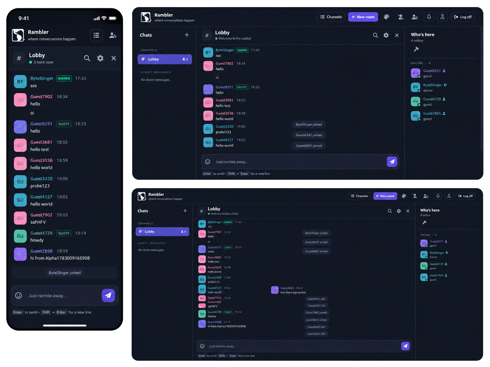

# Rambler.Web.Next — the Next.js UI

A modern **Next.js 15 / React 19** front-end for the Rambler chat server. It runs
alongside the legacy AngularJS client (which is still served by the .NET backend)
and talks to the same API + WebSocket protocol.

<p align="center">
  
</p>

- **Tailwind CSS v3** + a small design-token layer, **Font Awesome** icons, six switchable themes
- **Zustand** stores for auth + chat (multi-room, DMs, moderation, typing indicators)
- A tiny custom **`server.js`** that serves Next **and** proxies `/api` (REST) and the
  WebSocket upgrade to the .NET backend, so the browser only ever talks to one origin

---

## Quick start with Docker (recommended)

No Node, .NET, or Postgres install needed — just [Docker](https://docs.docker.com/get-docker/)
with Compose. All commands run from the **repository root** (`../`), where
`docker-compose.yml` lives.

```sh
# 1. Create your local config from the template (first time only)
cp .env.example .env

# 2. Build + start everything: db + .NET server + this UI
docker compose up -d --build
```

Then open the UI:

| Service | URL | Notes |
|---------|-----|-------|
| **Next.js UI** | http://localhost:5001 | this app — start here |
| .NET server (API + legacy client) | http://localhost:5000 | REST + WebSocket |
| Postgres | (internal) | expose 5432 in compose if you want host access |

> Ports are configurable via `WEB_NEXT_PORT` and `APP_PORT` in `.env`.

### Rebuild just the UI image

After changing anything under `Rambler.Web.Next/`, you only need to rebuild this
one service (the db + server keep running):

```sh
docker compose up -d --build web-next
```

Rebuild the backend instead when you touch the C# (`Rambler.Server` / `Rambler.Contracts`):

```sh
docker compose up -d --build server
```

Handy lifecycle commands:

```sh
docker compose logs -f web-next     # tail the UI container
docker compose ps                   # what's running
docker compose down                 # stop everything (keeps the db volume)
docker compose down -v              # stop and wipe the database volume
```

### How the UI image is built

`Rambler.Web.Next/Dockerfile` is a 3-stage `node:20-alpine` build:

1. **deps** — installs npm deps (`PLAYWRIGHT_SKIP_BROWSER_DOWNLOAD=1`, no browsers in the image)
2. **build** — `next build`; bakes the build-time arg `NEXT_PUBLIC_WS_URL` into the client bundle
3. **runner** — runs `node server.js` on **:5001**, with `BACKEND_URL=http://server:5000`
   (the in-network proxy target for `/api` and the ws upgrade)

---

## Local development (without Docker)

You still need the **backend + database** running (easiest: `docker compose up -d db server`).
Then:

```sh
cd Rambler.Web.Next
npm install
BACKEND_URL=http://localhost:5000 npm run dev   # hot-reload dev server on :5001
```

`npm run dev` launches the custom `server.js` (`PORT=5001`) which proxies `/api`
and the WebSocket to `BACKEND_URL`. Open http://localhost:5001.

Other scripts:

```sh
npm run build        # production build (next build)
npm run start        # run the production server locally on :5001
npm run lint         # eslint / next lint
npm run test:e2e     # Playwright end-to-end tests
npm run test:e2e:ui  # Playwright interactive UI mode
```

---

## Configuration

Compose passes these through from the root `.env` (see `.env.example`):

| Variable | Used by | Meaning |
|----------|---------|---------|
| `WEB_NEXT_PORT` | compose | host port mapped to the UI's `:5001` |
| `APP_PORT` | compose | host port mapped to the server's `:5000` |
| `BACKEND_URL` | `server.js` (runtime) | in-network target for `/api` + ws proxy (`http://server:5000` in Docker) |
| `NEXT_PUBLIC_WS_URL` | build arg (client) | WebSocket endpoint baked into the bundle. Empty ⇒ same-origin via the proxy; set `ws://localhost:5000` to connect straight to the backend |

### Request flow

```
browser ──HTTP──▶ :5001 (Next server.js)
                    ├── /api/*      ──▶  http://server:5000   (REST proxy)
                    └── ws upgrade  ──▶  server:5000          (WebSocket proxy)
```

The browser only ever hits `:5001`; `server.js` forwards REST and the WebSocket
to the .NET backend, so auth cookies stay same-origin.

---

## Project layout

```
src/
  app/                     Next App Router routes (login, register, chat, verify-email, tos)
  components/ui/           shared primitives (button, card, avatar, spinner, …)
  features/
    auth/                  login/register/guest, token refresh, password reset
    chat/                  the lobby: rooms rail, message stream, members, composer,
                           emoji picker, typing indicator, room/ban/admin modals
                           state/chat-store.ts  — the WebSocket + conversation store
    marketing/             the landing page (hero, features, architecture, lightbox)
    theme/                 six-theme switcher
    admin/                 server-admin API client
  types/protocol.ts        the WebSocket wire protocol (shared with Rambler.Contracts)
server.js                  custom Next server + REST/WebSocket proxy
```
